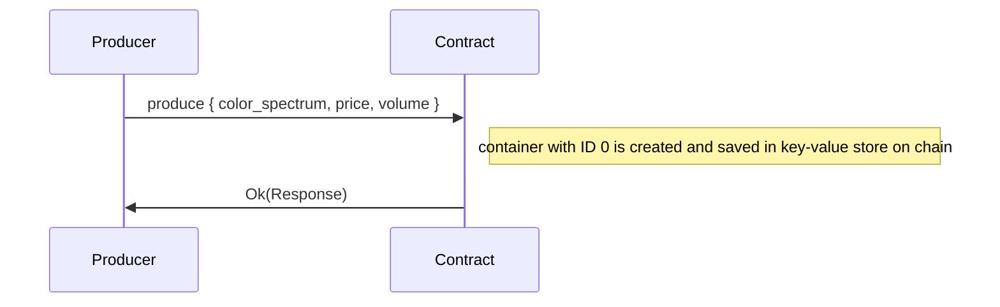
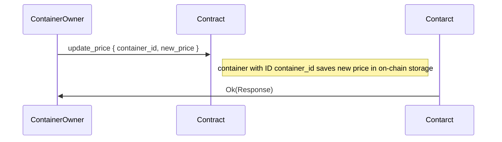
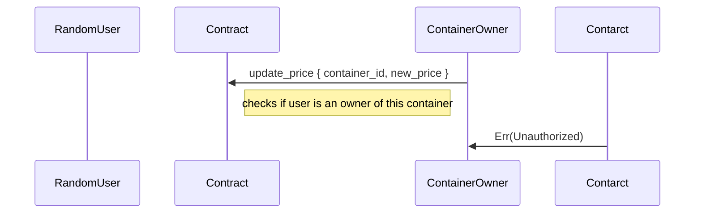
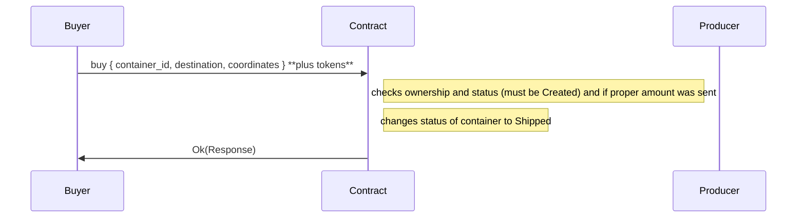
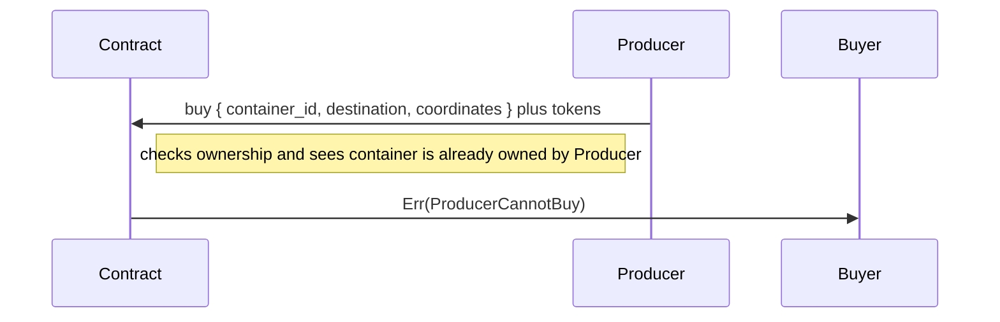
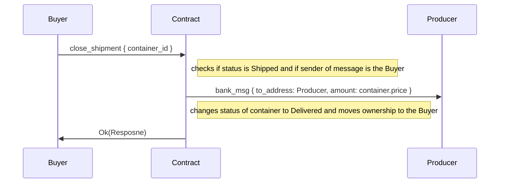
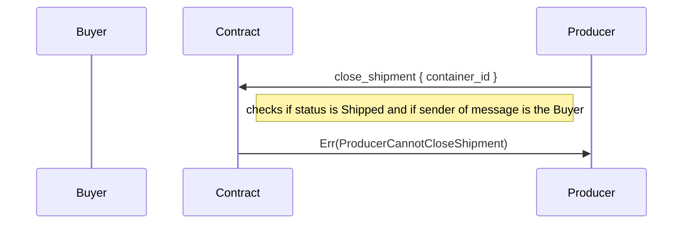
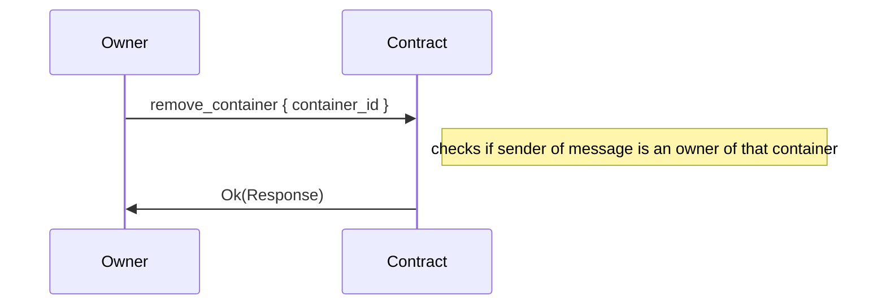
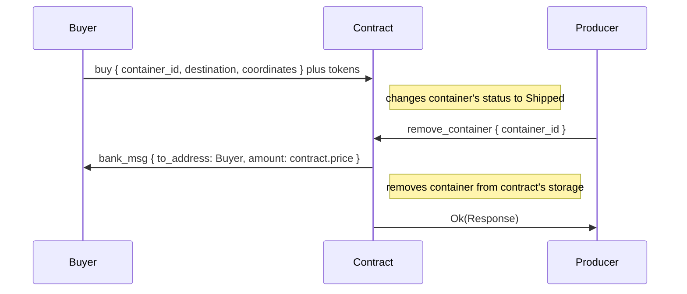
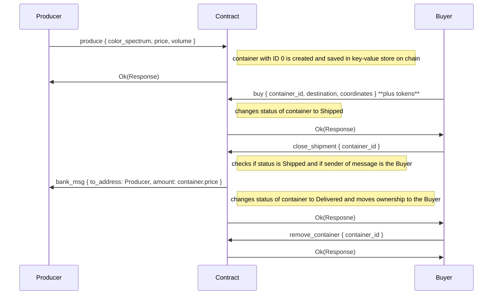

Hydrogen contract is main hub that allows you to create, list and buy containers of hydrogen.

## Produce



## Update price



Faulty case



## Buy




No tokens are sent along with `buy` message:

```mermaid
sequenceDiagram:
  participant Buyer
  participant Contract
  participant Producer
  Buyer->>Contract: buy { container_id, destination, coordinates }
  note right of Contract: checks ownership and status (must be Created) and if proper amount was sent
  Contract->>Buyer: Err(NotEnoughTokensSent)
```


Producer trying to buy his own container:




## Close shipment

If container is already bought and has `Shipped` status, ownership still belongs to Producer. Both `Producer` and `Buyer` is allowed to "close shipment", which marks container as `Delivered` and transfers ownership to `Buyer`.




Shippment can't be closed unless the Buyer confirms that it's been delivered and only then tokens are sent to Producer.




## Remove container

Container can be removed from memory at any point.



If container was already in shipped state, then tokens are being returned to the buyer.



## Whole flow




